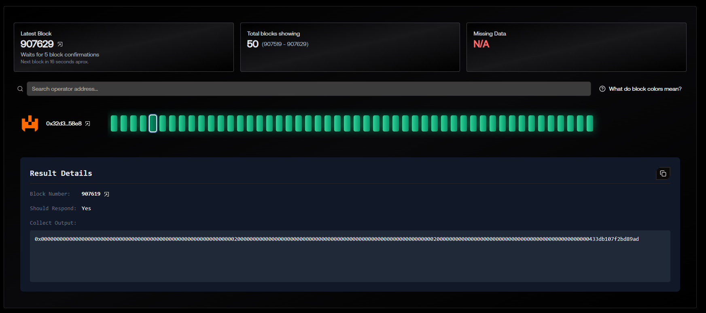
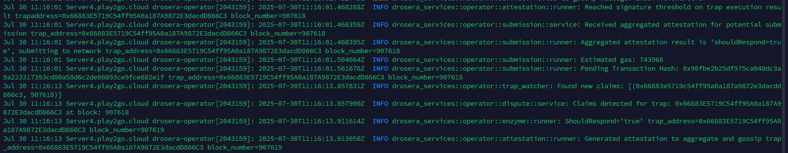

# WalletBalanceTrap — Drosera Trap

## 📌 Description
`WalletBalanceTrap` is a Drosera trap that monitors the ETH balance of a specific wallet in the **Hoodi** network and triggers if the balance changes by **more than 0.0001%** in any direction.

**Tracked wallet address**:
```
0x32d3526172408fb9C3d7c8b156FC23B96D1c58e8
```

---

## ⚙️ How It Works

1. **collect()** — fetches the current ETH balance of the target wallet.
2. **shouldRespond()** — compares the current block's balance with the previous block's balance.
3. If the balance change is greater than **0.0001%** (up or down), the function returns `true` and triggers the external contract `AlertLogger`.

---

## 📂 Trap Contract Code

(See `src/WalletBalanceTrap.sol`)

---

## 📡 External Receiver Contract (`AlertLogger.sol`)

// SPDX-License-Identifier: MIT
pragma solidity ^0.8.20;

interface ITrap {
    function collect() external view returns (bytes memory);
    function shouldRespond(bytes[] calldata data) external pure returns (bool, bytes memory);
}

contract WalletBalanceTrap is ITrap {
    // Адрес кошелька, баланс которого отслеживаем
    address public constant wallet = 0x32d3526172408fb9C3d7c8b156FC23B96D1c58e8;

    function collect() external view override returns (bytes memory) {
        return abi.encode(wallet.balance);
    }

    function shouldRespond(bytes[] calldata data) external pure override returns (bool, bytes memory) {
        if (data.length < 2) return (false, "Insufficient data");

        uint256 current = abi.decode(data[0], (uint256));
        uint256 previous = abi.decode(data[1], (uint256));

        if (previous == 0) return (false, "Previous balance is zero");

        uint256 diff = current > previous ? current - previous : previous - current;
        uint256 percent = (diff * 1_000_000) / previous; // 6 decimal precision

        // 0.0001% = 1 (in 1,000,000 scale)
        if (percent >= 1) {
            return (true, abi.encode("Wallet ETH balance changed > 0.0001%"));
        }

        return (false, "");
    }
}


---

## 🛠 Installation & Deployment

```bash
# Build the trap
forge build

# Deploy AlertLogger
forge create   --rpc-url https://rpc.hoodi.ethpandaops.io   --broadcast   --private-key 0xYOUR_PRIVATE_KEY   src/AlertLogger.sol:AlertLogger

# Configure drosera.toml
path = "out/WalletBalanceTrap.sol/WalletBalanceTrap.json"
response_contract = "0xALERTLOGGER_ADDRESS"
response_function = "logAnomaly(string)"

# Apply trap
DROSERA_PRIVATE_KEY=0xYOUR_PRIVATE_KEY drosera apply
```

---

## 📷 Screenshots
- **Dark green block** in Drosera Dashboard:


- **Node logs** showing `shouldRespond == true`:


---

## 🏆 Result
- Trap successfully deployed in the Hoodi network
- Reacts to significant ETH balance changes of the tracked wallet
- Produces dark green blocks and triggers the `AlertLogger` external contract

---

## 📬 Role Request
**Requesting Sergeant / Captain role in Drosera**  
Dashboard link: [DASHBOARD_LINK]  
GitHub repository: [GITHUB_REPO_LINK]
